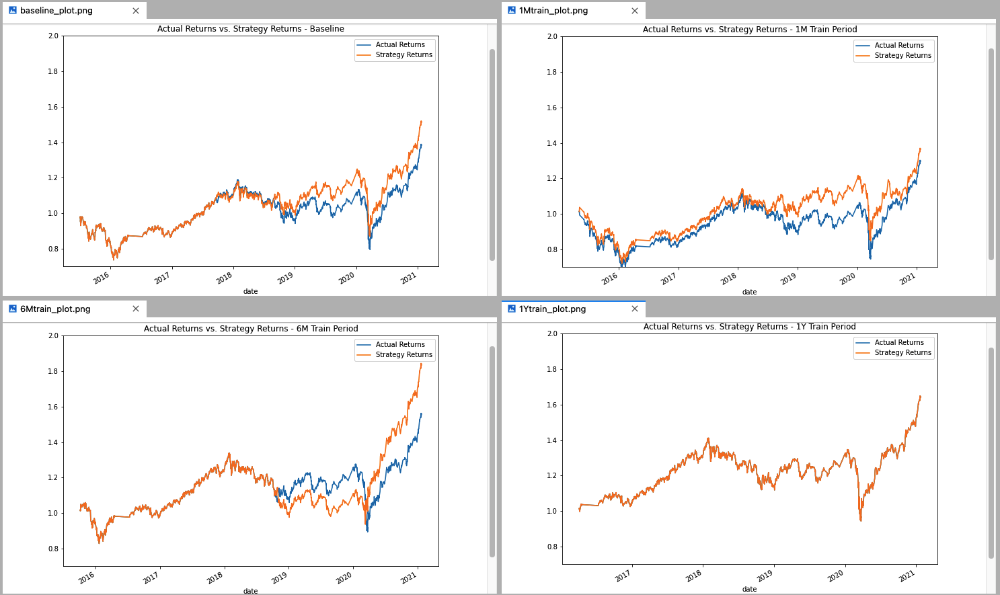
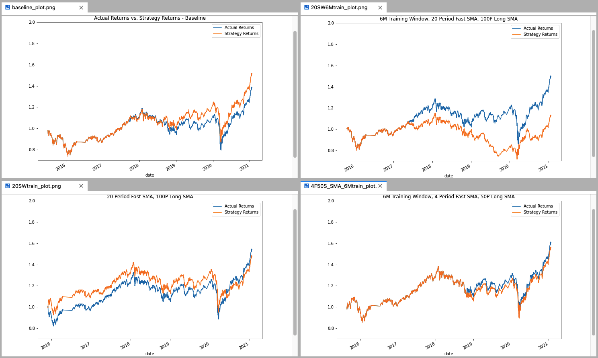

# UW_Fintech_Challenge_14

## Project Description

## Project Analysis

### Tuning the Baseline ML Algorithm
The first step in tuning the baseline ML algorithm was to test different sized training windows for the model and analyze the results. 

The baseline training window for the model was 3-months. During the tuning process I tried three additional windows:
+ 1 Month Training Window
+ 6 Month Training Window
+ 12 Month Training Window

Once the model was fit to the training data, I plotted the cumulative returns to a plot with a set y-scale of .7 to 2.0 so that I could compare the results of each model.

The result was that the 6-month training window seemed to yield the most effective model long-term, however, it had a long period of performance that was less than the actual returns so it also seemed to be the most risky model to use. The baseline plot (3M Training window) returned better results than the 1M training window plot but both of these were quite similar and seemed to follow closely along with the actual returns, just a bit higher. When I expanded the training window to 12-months, the model seemed to overfit the data and returned zero sell signals. For this reason the strategy returns mirred the actual returns exactly. 

**All four training window plots are shown below:**

The second step in the tuning process was to test different simple moving average windows and compare the results.

Initially our short or "fast" window was set to 4. Our long or "slow" window was set to 100. I tried three other combinations to see what the results were:
+ Baseline Training Window (3 Monhts) \+ 20 Period Fast SMA
+ 6-Month Training Window \+ 20 Period Fast SMA
+ 6-Month Training Window \+ 4 Period Fast SMA & 50 Period Slow SMA

The results were strategy returns less than that of th baseline model on all three situations. Having a longer fast SMA, 20 days in these examples, proved to make the returns tank in both the 3-month training window and the six month training window. Changing the slow SMA to 50 (reducing it by half of the baseline) also resulted in lower returns.

**All four SMA plots are shown below:**

## Technologies

