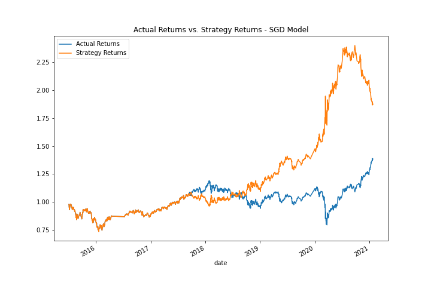

# UW_Fintech_Challenge_14

## Project Description

## Project Analysis

### Tuning the Baseline ML Algorithm
The first step in tuning the baseline ML algorithm was to test different sized training windows for the model and analyze the results. 

The baseline training window for the model was 3-months. During the tuning process I tried three additional windows:
+ 1 Month Training Window
+ 6 Month Training Window
+ 12 Month Training Window

Once the model was fit to the training data, I plotted the cumulative returns to a plot with a set y-scale of .7 to 2.0 so that I could compare the results of each model.

The result was that the 6-month training window seemed to yield the most effective model long-term, however, it had a long period of performance that was less than the actual returns so it also seemed to be the most risky model to use. The baseline plot (3M Training window) returned better results than the 1M training window plot but both of these were quite similar and seemed to follow closely along with the actual returns, just a bit higher. When I expanded the training window to 12-months, the model seemed to overfit the data and returned zero sell signals. For this reason the strategy returns mirred the actual returns exactly. 

**All four training window plots are shown below:**

The second step in the tuning process was to test different simple moving average windows and compare the results.

Initially our short or "fast" window was set to 4. Our long or "slow" window was set to 100. I tried three other combinations to see what the results were:
+ Baseline Training Window (3 Months) \+ 20 Period Fast SMA
+ 6-Month Training Window \+ 20 Period Fast SMA
+ 6-Month Training Window \+ 4 Period Fast SMA & 50 Period Slow SMA

The results were strategy returns less than that of the baseline model on all three situations. Having a longer fast SMA, 20 days in these examples, proved to make the cumulative returns fall short of the actual returns in both the 3-month training window and the six month training window. Changing the slow SMA to 50 (reducing it by half of the baseline) also resulted in a lower return, although just barely. Other variations of the fast and slow SMAs were tried as well and none could be found that resulted in higher returns than the baseline windows. 

**All four SMA plots are shown below:**

In conclusion, after tuning the baseline algorithm the best performing adjustment was setting the training period from 3-months to 6-months and not changing the fast and slow SMAs. This model resulted in cumulative returns of a little over 1.8%.  

  

### An Alternative ML Model: Stochastic Gradient Descent Model

The final step of the analysis was to try a different machine learning model using the original training data. The model that I chose was a Stochastic Gradient Descent (SGD) model. Once fit and trained on the original features (3-month training window and 4 Fast SMA, 100 Slow SMA) this model produced the best results. There was a brief period during 2018 to 2019 where the model had lower returns than actual but then the model took off and out performed the actual returns by a signifcant amount from 2020 to mid-2021. The SGD model did end on a downturn so it would be interesting to see how it keeps performing going forward - whether it recovers or not. All-in-all, through the period looked at the model had around a 2.0% cumulative return.  

## Technologies

